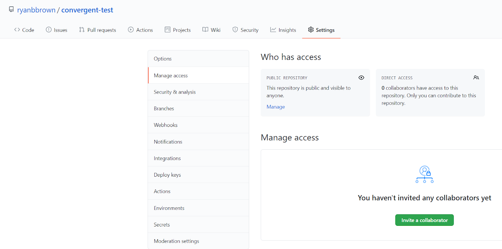
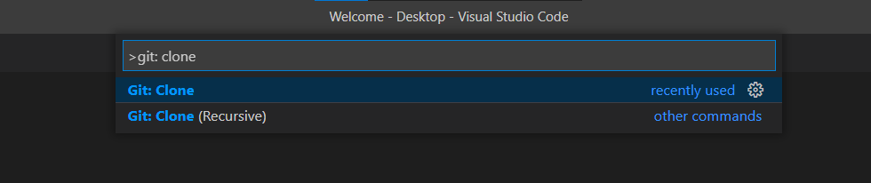
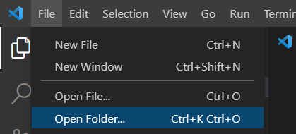
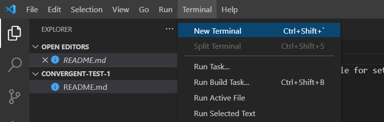
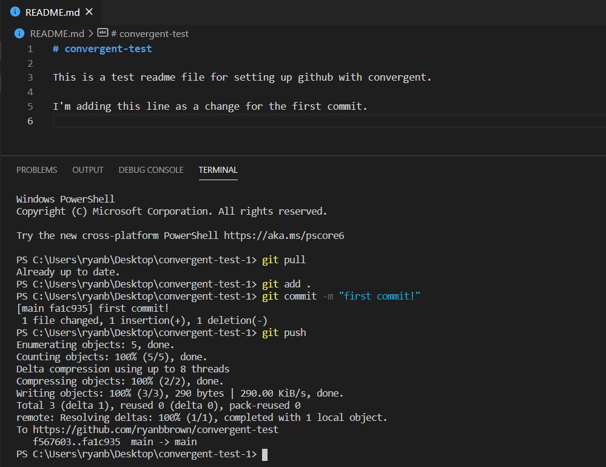
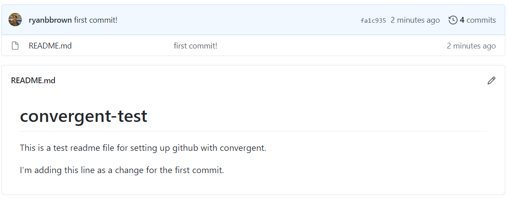
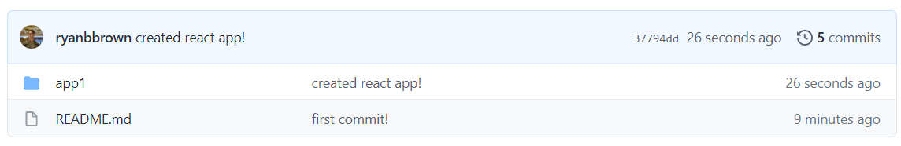
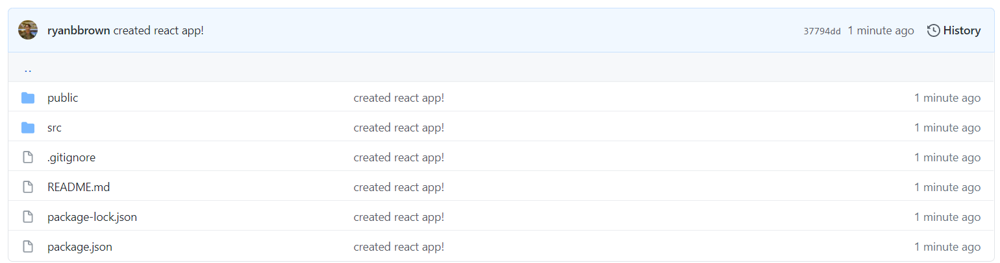

# VSCode / GitHub Setup Guide

## Step 1: Set up VSCode
VSCode is a very popular code editor that we'll be using to build products this semester. 
Set up VSCode on your computer using the video tutorial at [this link](https://youtu.be/KZShSK6oyEo).

## Step 2: Download git
Git is a version control system that you'll use to collaborate with your team on GitHub. Follow 
[these instructions](https://github.com/git-guides/install-git) to download Git on your computer for Mac or Windows, respectively.

When going through the install manager for Windows, you can keep all the default settings except when it comes up with 
*Configuring the terminal emulator to use with Git Bash*; you can change it from *Use MinTTY* to *Use Windows' default console 
window*. This isn't necessary, as Windows' console window has some limitations, but it may be more accessible if you aren't familiar
with the Linux command line.

## Step 3: Create a GitHub account
Create a GitHub account on [github.com](https://github.com/)

## Step 4: Create an empty repository
Once on your github account, click on the plus in the top right corner, and then click *New repository*. 
Initialize the repository with a README file. 

Only one person per group needs to do this if you all plan to work on the same code. 


## Step 5: Sharing the repository
Once you have the repository open on github, click on *Settings* and then *Manage access* to control who has access 
to the repository. Click *Invite a collaborator* to add your team members by username, email address, or full name.




## Step 6: Cloning the repository on your computer
In VSCode, use ```CTRL+SHIFT+P``` (or the Mac equivalent) to open the Command Palette, then type in ```Git: Clone```
and click on it or hit enter. 



Copy the URL of the git repository (in my case, it’s https://github.com/ryanbbrown/convergent-test), and paste it into the text box. Click enter, and select the location on your local machine that you’d like to store the cloned repository. 

## Step 7: Opening the repository


Go to File ⇒ Open Folder, and open the cloned repository. 

Once you have it open, you’ll also want to open a new terminal to be able to run git commands.



## Step 8: Making changes
Every time you make changes to files or code in the repository, you'll want to run the following commands in the terminal:

```
git pull                # run this before you make any changes to stay updated with the file
git add .               # adds all the changes to a queue of sorts
git commit -m "name"    # keep the quotation marks, "name" is what you want to call your commit
git push                # pushes the changes to the GitHub repository, making them visible to everyone
```





## Step 9: Create a react application
If you’ve set up VSCode properly as per step 1, you should be able to create a react app and push the changes to your repository. 
Do that with the command ```npx create-react-app app_name```. *app_name* can be whatever you want, I called mine *app1* for the purposes of this tutorial. 





That’s it! You and your team should be ready to start developing your react app. Next week we’ll go in-depth on React in a lecture, 
and you’ll replace your existing code with a commented sample app that explains all the basics. 
