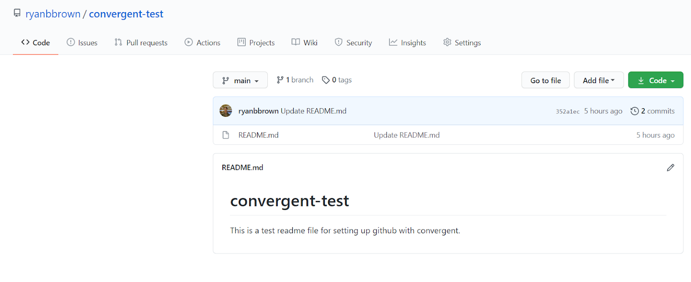

# VSCode / GitHub Setup Guide

### Step 1: Set up VSCode
VSCode is a very popular code editor that we'll be using to build products this semester. 
Set up VSCode on your computer using the video tutorial at [this link](https://youtu.be/KZShSK6oyEo).

### Step 2: Download git
Git is a version control system that you'll use to collaborate with your team on GitHub. Follow 
[these instructions](https://github.com/git-guides/install-git) to download Git on your computer for Mac or Windows, respectively.

When going through the install manager for Windows, you can keep all the default settings except when it comes up with 
*Configuring the terminal emulator to use with Git Bash*; you can change it from *Use MinTTY* to *Use Windows' default console 
window*. This isn't necessary, as Windows' console window has some limitations, but it may be more accessible if you aren't familiar
with the Linux command line.

### Step 3: Create a GitHub account
Create a GitHub account on [github.com](https://github.com/)

### Step 4: Create an empty repository
Once on your github account, click on the plus in the top right corner, and then click *New repository*. 
Initialize the repository with a README file. 

Only one person per group needs to do this if you all plan to work on the same code. 


newline



### Step 5: Sharing the repository
Once you have the repository open on github, click on *Settings* and then *Manage access* to control who has access 
to the repository. Click *Invite a collaborator* to add your team members by username, email address, or full name.

### Step 6: Cloning the repository on your computer
In VSCode, use ```CTRL+SHIFT+P``` (or the Mac equivalent) to open the Command Palette, then type in ```Git: Clone```
and click on it or hit enter. 
